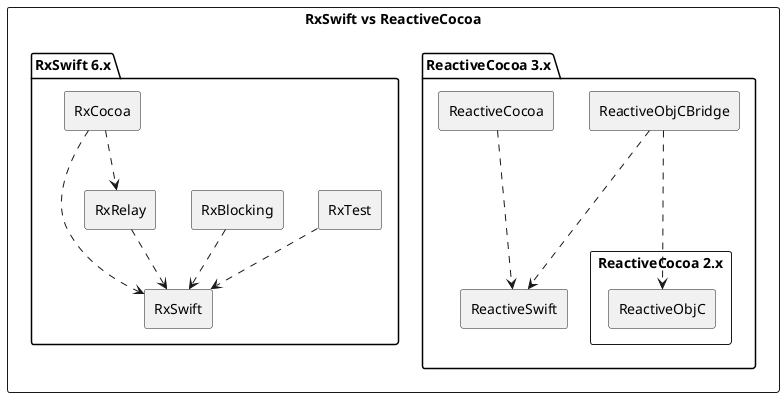
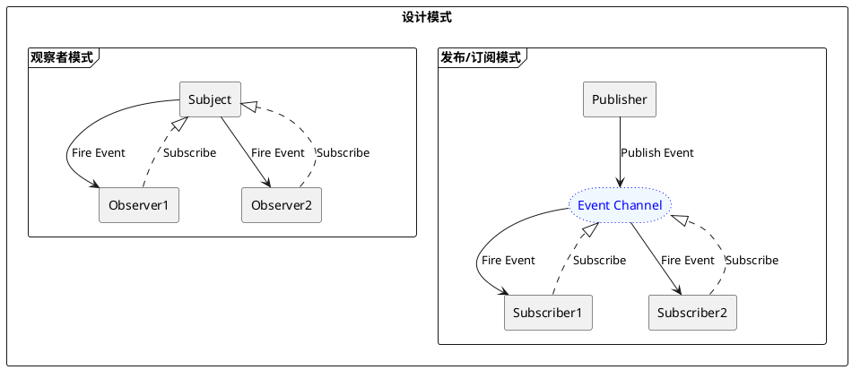

![][image-1]

首先说明的是这并不是教大家如何使用 RxSwift API 的教程，更多的是要让大家理解 Rx 的思想，最后能够通过这套思想解决实际的问题。

<!-- more -->

## 一、简介

RxSwift 顾名思义，它其实是 Swift 语言的一个框架「库」。要了解 RxSwift 就不得不提 Reactive Extensions[^1]。最初是 LINQ[2] 的一个扩展，由微软的架构师 Erik Meijer 领导的团队开发，在 2012 年 11 月开源。Rx 是一个编程模型，目标是提供一致的编程接口，帮助开发者更方便的处理异步数据流。而 RxSwift 正式基于 Reactive Extensions 标准的 Swift 版本实现。

Rx 提供用于可观察流[^2]的异步编程的 API。结合了观察者模式[^3]、迭代器模式[^4]和函数式编程[^5]的思想，有人说它是函数响应式编程[^6]，但是 Rx 自己却说：

> It is sometimes called "functional reactive programming" but this is a misnomer. ReactiveX may be functional, and it may be reactive, but "functional reactive programming" is a different animal.

大概意思是说：“有时候称 ReactiveX 为‘函数响应式编程’，但是说法不太准确。它可以是函数式的，也可以是响应式的，但是‘函数响应式编程’是个不同的东西。”。

[微软官方解释](https://archive.codeplex.com/?p=rx)：Rx 是一个库，用于使用可观察的序列和 LINQ-style 的查询运算符来组成异步和基于事件的程序，也就是：`Rx = Observables + LINQ + Schedulers`。我们也可以简单理解为：`Rx = Observables + Operators + Schedulers`。

Rx 是一个编程模型或者说是一套编程思想。Rx 并没有规范命名规则，因为编程语言会有自己的命名规范，但是因为最早 Rx 的开源实现是来之 .Net 的 RxNet，很多语言的版本实现时的命名也就参考了 RxNet，久而久之就形成了一套不成文的命名习惯。

## 二、为什么要学习 RxSwift？

- 几乎所有热门编程语言都会有 Rx 对应的实现版本，也就是说它是跨平台的，保持 “Once and Only Once”[^8] 原则。
- 统一所有传统值传递方式 Target-Action、Delegate、Notifications、KVO、Block。
- 将所有操作统一为异步处理，有效避免 Callback Hell。
- 统一错误处理，能够抽象异步编程，使我们统一了代码风格。
- 对应程序员来说，学习一门技术是需要花费很多时间和经历的，如果一个技能能够用在多个地方肯定是最好的。
- 非常适合与 MVVM 设计模式配合使用
- ...

对比下两段代码

```kotlin
Observable.create<String> {
    Log.d(TAG, "事件产生线程：${Thread.currentThread().name}")
    it.onNext("rx")
    it.onComplete()
}
.subscribeOn(Schedulers.io())
.observeOn(AndroidSchedulers.mainThread())
.subscribe {
    Log.d(TAG, "事件消费线程：${Thread.currentThread().name}")
    Log.d(TAG, it)
}
```

```swift
Observable<String>.create {
    print("事件产生线程：\(Thread.current.description)")
    $0.onNext("rx")
    $0.onCompleted()
    return Disposables.create()
}
.subscribe(on: ConcurrentMainScheduler.instance)
.observe(on: MainScheduler.instance)
.subscribe {
    print("事件消费线程：\(Thread.current.description)")
    print($0)
}
```

从上面可以看出：1.Kotlin 和 Swift 的语言相似度非常高。2.Rx 操作完全一致。

## 三、Reactive 相关库实现选择

### 1. Apple's Combine

Combine 是 Apple 自己实现的 Reactive Streams 标准，只支持 iOS13 及以上系统，服务于 SwiftUI，不支持 UIKit。

### 2. RxSwift vs ReactiveCocoa


ReactiveCocoa 借用了大量 Rx 概念，是一套 “函数响应式编程” 的 iOS 库，自成一体。千万不要和 RxSwift 搞混了。
- `RxSwift`：RxSwift 的核心，主要提供是 ReactiveX 定义标准的实现。它没有其他依赖项。跨平台。
- `RxRelay`：实现 PublishRelay、BehaviorRelay 和 ReplayRelay 三个类，他们都是 Subject 的子类。依赖 RxSwift。跨平台。
- `RxTest` 和 `RxBlocking`：为基于 Rx 的系统提供测试功能。依赖 RxSwif。跨平台。
- `RxCocoa`：为 iOS、macOS、watchOS、tvOS 应用开发提供特定的 Cocoa、CocoaTouch 扩展功能。依赖 RxSwift 和 RxRelay。特定平台。

## 四、KVO & Binder

之前说过 Rx 可以理解为：`Rx = Observables + Operators + Schedulers`。下面我们理解下这其中的含义，

### 1. Scheduler[^9]

`Scheduler` 调度器：将执行任务的机制抽象化。其中包括当前执行任务的线程、Dispatch Queue、Operation Queue、新开线程、线程池和 RunLoop。听起来很难理解，其实就是 Rx 为了统一 Scheduler 的概念，将特定平台的多线程机制、队列和线程管理统一对外的调用接口的方式。

RxSwift 内置的几种 Scheduler

- CurrentThreadScheduler (串行 scheduler)：当前执行任务的默认 scheduler。类比 Thread.current。
- MainScheduler (串行 scheduler)：主要负责 UI 刷新工作的 scheduler。类比 Thread.main。
- SerialDispatchQueueScheduler (串行 scheduler)：基于 GCD `dispatch_queue_t` 的封装。
- ConcurrentDispatchQueueScheduler (并行 scheduler)：基于 GCD `dispatch_queue_t` 的封装。
- OperationQueueScheduler (并行 scheduler)：基于 `NSOperationQueue` 的封装。

### 2. Operators[^10]

`Operators` 算子、运算子、运算符、操作符：在数学里面有函数的概念，即：设 A、B 是非空的数集，如果按照某个确定的对应关系 f，使对于集合 A 中的任意一个数 x，在集合 B 中都有唯一确定的数 f(x) 和它对应，那么就称 f：A→B 为从集合 A 到集合 B 的一个函数。

```swift
func addOne(_ a: Int) -> Int { a + 1 }
let A = [2, 4, 6, 8] // 输入：集合 A {2, 4, 6, 8}
let B = A.map(addOne) // 输出：集合 B {3, 5, 7, 9}
```

或者

```swift
[2, 4, 6, 8].map { $0 + 1 } // 输出：集合 {3, 5, 7, 9}
```

从上面可以看出数学的函数跟编程里面的函数，大致上是相同的「虽然有些地方不一样，比如副作用」。那么 Operator 是什么呢？
在 `1 + 1 = 2` 这个算式中运算符 `+` 就是 Operator。其实数学里面概念和计算机的概念是一样的，都有：算术运算符、赋值运算符、比较运算符、逻辑运算符、条件运算符。在 Rx 里面也有运算符的概念，大概可以分为 11 类，约 80 个操作符左右：

1. Creating Observables：用于创建 Observable 的操作符集合，比如：`Create`
2. Transforming Observables：用于转换、变形 Observable 的操作符集合，比如：`Map`
3. Filtering Observables：用于过滤、筛选 Observable 的操作符集合，比如：`Filter`
4. Combining Observables：用于组合 Observable 的 Observable 的操作符集合，比如：`Zip`
5. Error Handling Operators：用于错误处理的 Observable 的操作符集合，比如：`Catch`
6. Observable Utility Operators：工具类 Observable 的操作符集合，比如：`Timeout`
7. Conditional and Boolean Operators：Observable 之间条件运算的操作符集合，比如：`Contains`
8. Mathematical and Aggregate Operators：对元素进行运算的操作符集合，比如：`Count`
9. Backpressure Operators：RxSwift 没有实现
10. Connectable Observable Operators：需要特殊控制 Observable 的操作符集合，比如：`Publish`
11. Operators to Convert Observables：将 Observable 装成另一种类型或者数据结构的操作符集合，比如：`To`

```swift
Observable<Int>.from([2, 4, 6, 8]).map { $0 + 1 }.toArray().subscribe { print($0) }.dispose()
// 输出：success([3, 5, 7, 9])
// from、map、toArray、subscribe、dispose 都是操作符
```

Rx 每种特定语言都实现了一组操作符「各种语言实现的操作符总共大约 500 个」。尽管实现功能有很多重叠，但是也有一些因为编程语言或者平台特性做一些特殊的实现。同样的，每个操作符都会根据平台语言的特性做一些命名上的调整，可以更加贴近语言本身。好比乘法运算符，有的国家使用 `·` 表示，而有的国家使用 `×` 表示，和小数点 `.` 以示区分，而计算机编程语言大部分使用 `*` 表示，虽然写法不一样，但是意义都相同。

### 3. Observable[^11]

Rx 本身就是对观察者模式「Observer pattern」的扩充「扩展」，在 Apple 系统的平台，对观察者模式的一个实现就是 `KVO`，我们先看下 KVO 的操作：

```objc
// 1. 添加
[self addObserver:self forKeyPath:@"viewModel.content" options:NSKeyValueObservingOptionInitial | NSKeyValueObservingOptionNew context:NULL];

// 2. 监听改变
- (void)observeValueForKeyPath:(NSString *)keyPath ofObject:(id)object change:(NSDictionary<NSKeyValueChangeKey,id> *)change context:(void *)context {
    if ([keyPath isEqualToString:@"viewModel.content"]) {
        [self.contentLabel setValue:self.viewModel.content forKey:@"text"];
    } else {
        [super observeValueForKeyPath:keyPath ofObject:object change:change context:context];
    }
}

// 3. 移除
[self removeObserver:self forKeyPath:@"viewModel.content" context:NULL];

```

在上面的代码中 viewModel 的 content 字段就是一个 Observable，只要 content 发生改变，那么 contentLabel 的 text 也就会发生响应的变化，我们可以简化下代码：

```objc
// 1. 添加
[self.viewModel bind:@"content" to:self.contentLabel at:@"text"];
// 2. 移除
[self.viewModel dispose];
```

上面 `bind` 函数的核心逻辑在[这里](https://)。意思很明白，就是将 self.viewMode 对象的 content 字段与 self.contentLabel 对象的 text 属性绑定在一起。我们使用 RxSwift 重写下这个逻辑看：

```swift
viewModel.content.bind(to: contentLabel.rx.text).disposed(by: disposeBag)
```

可以看到使用 RxSwift 写的绑定逻辑与 OC 写的绑定函数逻辑基本一致，从这里可以看出：1. 在 RxSwift 里面对界面与数据的绑定底层实现使用的可能是 KVO，看过 RxSwift 源码之后发现也确实是这样的。而 viewModel 的 content 属性我们也是定义为 Observable 对象。

```swift
Observable<Int>.from([2, 4, 6, 8]).map { $0 + 1 }.toArray().subscribe { print($0) }.dispose()
// 输出：success([3, 5, 7, 9])
// from、map、toArray、subscribe、dispose 都是操作符
```

我们回头看下这段代码：`Observable`、`from`、`map`、`toArray` 很好理解，上面已经说过了。那么 `subscribe` 和 `dispose` 又是做上面的呢？

## 四、订阅和发布



### 1. 观察者模式

观察者模式定义了对象间的一种一对多的依赖关系，当一个对象的状态发生改变时，所有依赖于它的对象都将得到通知，并自动更新。观察者模式属于行为型模式，行为型模式关注的是对象之间的通讯，观察者模式就是观察者和被观察者之间的通讯。

观察者模式有一个别名叫“发布-订阅模式”，或者说是“订阅-发布模式”，订阅者和订阅目标是联系在一起的，当订阅目标发生改变时，逐个通知订阅者。

### 2.发布/订阅模式

其实 24 种基本的设计模式中并没有发布订阅模式，上面也说了，他只是观察者模式的一个别称。

但是经过时间的沉淀，似乎他已经强大了起来，已经独立于观察者模式，成为另外一种不同的设计模式。
在现在的发布订阅模式中，称为发布者的消息发送者不会将消息直接发送给订阅者，这意味着发布者和订阅者不知道彼此的存在。在发布者和订阅者之间存在第三个组件，称为调度中心或事件通道，它维持着发布者和订阅者之间的联系，过滤所有发布者传入的消息并相应地分发它们给订阅者。

可以看出，发布订阅模式相比观察者模式多了个事件通道，事件通道作为调度中心，管理事件的订阅和发布工作，彻底隔绝了订阅者和发布者的依赖关系。即订阅者在订阅事件的时候，只关注事件本身，而不关心谁会发布这个事件；发布者在发布事件的时候，只关注事件本身，而不关心谁订阅了这个事件。

观察者模式有两个重要的角色，即目标和观察者。在目标和观察者之间是没有事件通道的。一方面，观察者要想订阅目标事件，由于没有事件通道，因此必须将自己添加到目标(Subject) 中进行管理；另一方面，目标在触发事件的时候，也无法将通知操作(notify) 委托给事件通道，因此只能亲自去通知所有的观察者。

观察者模式和发布/订阅模式思路是一样的，做的都是通一件事情，即：当一个对象的状态发生改变时，所有依赖于它的对象都将得到通知，并自动更新。他们之间的区别在于：

- 观察者模式中 `Subject` 和 `Observer` 之间是相互依赖的，两个角色。
- 发布/订阅模式中 `Publisher` 和 `Subscriber` 之间是完全解耦合的，但是他们之间多了另外一个角色——经纪人 Broker，用于负责数据的调度或中转。

### 3. Rx `Subscribe`

从上面的例子我们可以知道，Rx 里面的概念包含有观察者模式或者发布/订阅模式，在这两种模式中都有一个共同的特点：监听对象的变化，并且有通知自己的能力，这种能力就需要订阅操作。观察者模式和发布/订阅模式里面称这种能力为 `Subscribe`，Rx 里面也延用这种写法。

- 在观察者模式和发布/订阅模式中的 `Subject` 和 `Publisher` 角色在 RxSwift 中称为 `Observable`。
- 在观察者模式和发布/订阅模式中的 `Observer` 和 `Subscriber` 角在 RxSwift 中称为 `Observer`。
- 在观察者模式和发布/订阅模式中的 `Subscribe` 操作在 RxSwift 中称为 `Subscribe`。

`Subscribe` 操作符是连接 Observer 和 Observable 的桥梁，为了让 Observer 可以监听到 Observable 发出的元素 `onNext`、错误 `onError` 或完成 `onCompleted` 的通知，它首先就需要通过 `Subscribe` 操作符订阅 Observable。

```swift
Observable<String>.create { observer in
	observer.onNext("🐶")
	observer.onNext("🐱")
	observer.onNext("🐭")
	observer.onCompleted()
	return Disposables.create()
}.subscribe { value in
	print(value)
} onError: { error in
	print(error)
} onCompleted: {
	print("Completed")
}.disposed(by: disposeBag)
```

- `onNext` 当 Observable 发出元素时，他就会调用此方法，将元素作为参数发送出去。
- `onError` 当 Observable 遇到错误时会调用此方法，并且不会再次调用 onNext、onCompleted 方法。
- `onCompleted` 当 Observable 在执行的过程中没有发生任何错误，那么在最后一次执行 onNext 方法之后就会调用此方法。

### 5. "冷"「Cold」、"热"「Hot」Observable

- 一个 Observable 在没有订阅之前不会发送元素，就称之为“冷” Observable。
- 一个 Observable 在没有订阅之前也会发送元素，就称之为“热” Observable。

Rx 中并没有“冷”、“热” Observable 这种对象，但是会有“冷”、“热”状态的「概念」，他们都是通过操作符来转换，Rx 中有一类称为 “Connectable” 的 Observable，这样的 Observable 需要调用其 Connect 方法才会开始发出元素，无论是否有无 Observer 订阅它。

- 普通 Observable 转 Connectable Observable：`Publish`、`Connect`、`multicast`、`replay`、`replayAll`、`share
- Connectable Observable 转 普通 Observable：`refCount`

Rx 中并没有“冷”、“热” Observable 这种对象，但是在使用 Rx 的过程中还是需要注意他们之间的区别。`Cold Observable` 我们可以观察到整个序列，`Hot Observable` 有可能是不完整的，且只能观察到 `Subscribe` 之后发出的元素，之前没有 `Subscribe` 的元素则直接丢失。

## 五、Subject & Disposable

- Subject 既是可 Observable 也是 Observer，大量用在 RxCocoa 中。
- Disposable 用于管理 Observable 的生命周期，如果一个 Observable 是 Disposable 的，那么可以被 DisposeBag 所管理。

## 链接

[RxSwift](https://github.com/ReactiveX/RxSwift)
[ReactiveX](http://reactivex.io/)
[MVVM](https://zh.wikipedia.org/wiki/MVVM)
[ReactiveX 文档中文翻译](https://mcxiaoke.gitbooks.io/rxdocs/content/Intro.html)
[RxSwift 社区](http://community.rxswift.org/)

## 注解

[^1]: Reactive Extensions 也叫 ReactiveX 或者 Rx
[^2]: LINQ 语言整合式查询，是一组以直接将查询功能整合至 C# 语言为基础之技术的名称
[^3]: Observable streams
[^4]: Observer pattern
[^5]: Iterator pattern
[^6]: Functional Programming
[^7]: Functional Reactive Programming 简称 FRP
[^8]: 软件工程名著《The Pragmatic Programmer》首先提出了这个原则。它的涵义是，系统的每一个功能都应该有唯一的实现。也就是说，如果多次遇到同样的问题，就应该抽象出一个共同的解决方法，不要重复开发同样的功能。这个原则有时也称为"一次且仅一次"原则（Once and Only Once）。
[^9]: Scheduler 调度器
[^10]: Operators 算子、操作符、运算符
[^11]: Observable 可观察对象

[image-1]: /images/2021/01-logos.png